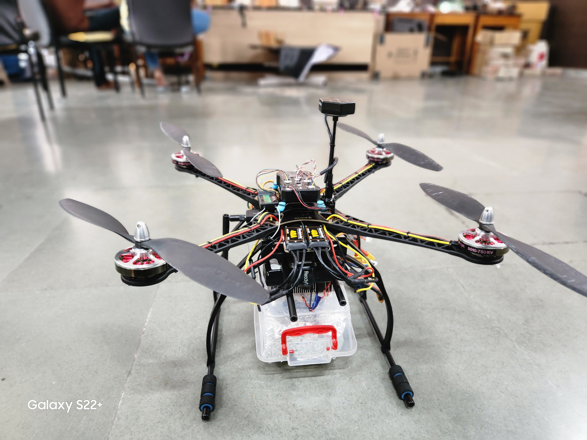
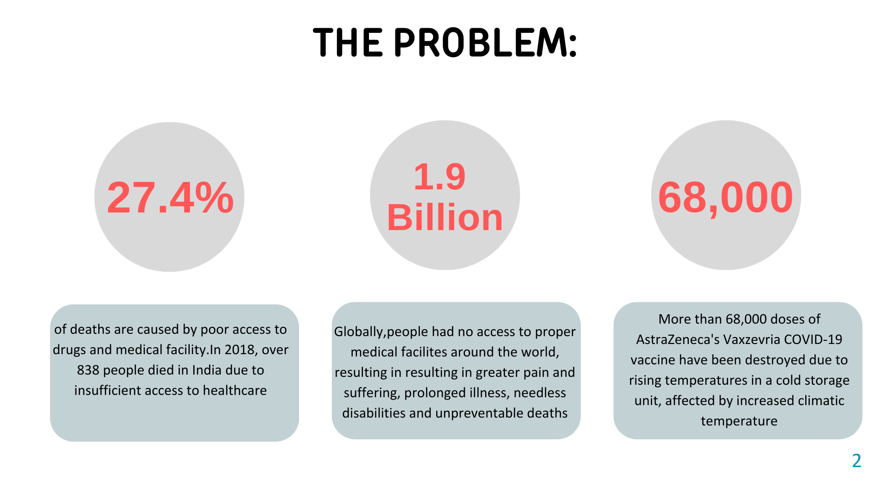
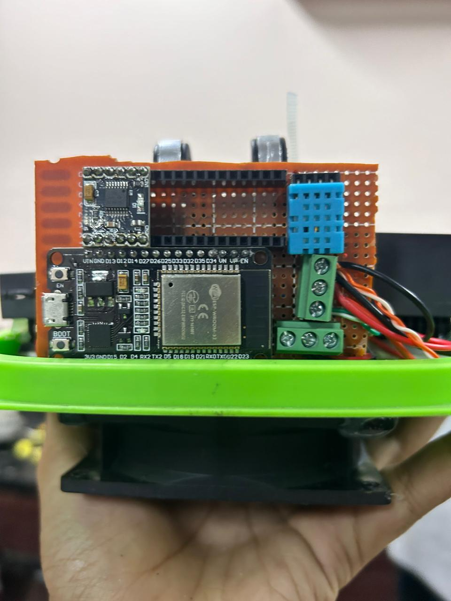
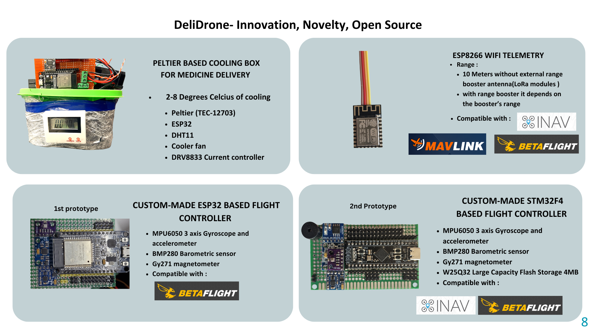
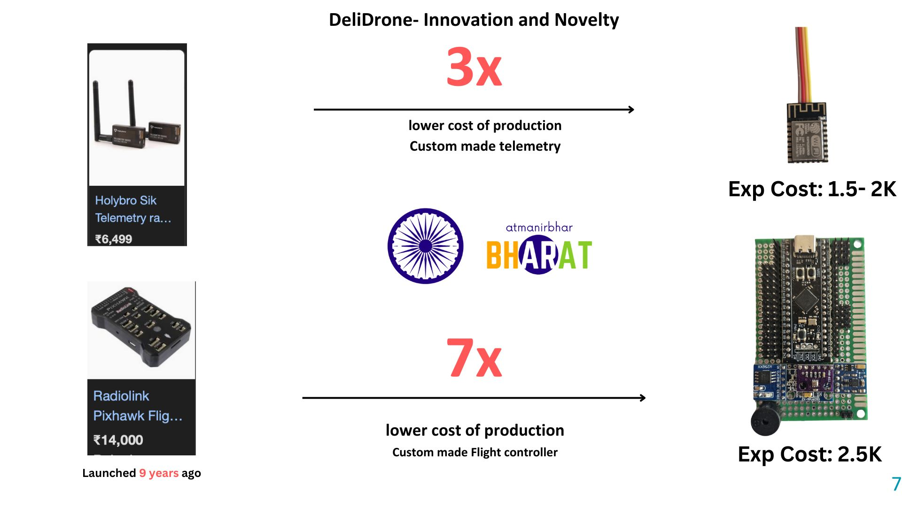
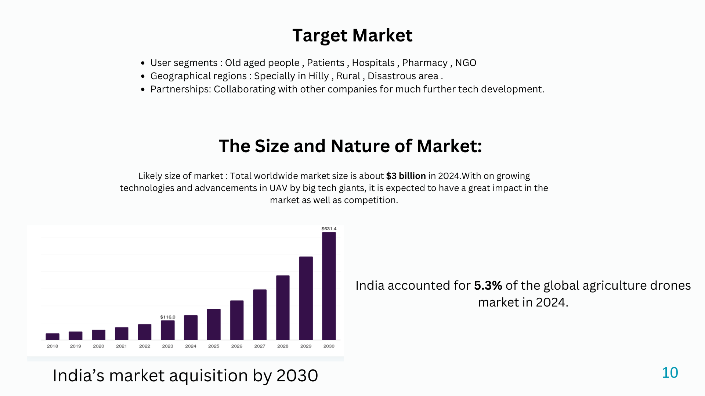

# DeliDrone 🚁💊
### Autonomous Medicine Delivery at Regulated Temperature

> Revolutionising Medicine Access for New India

  
   
  <em>DeliDrone — Autonomous UAV with Peltier Cooling Box</em>

---

## 📌 Overview

DeliDrone is an autonomous UAV system designed to deliver temperature-sensitive medicines — particularly vaccines — to remote, hilly, and disaster-affected regions of India where conventional healthcare access is limited or absent.

The drone features a **Peltier-based active cooling box** to maintain medicines within the critical **2–8°C** range during flight, combined with a fully autonomous flight system powered by a custom-built flight controller.

---

## 🔥 The Problem

  

- **27.4%** of deaths worldwide are caused by poor access to drugs and medical facilities
- In 2018, over **838 people died in India** due to insufficient access to healthcare
- More than **68,000 doses** of AstraZeneca's COVID-19 vaccine were destroyed due to temperature failures in cold storage
- **1.9 Billion** people globally lack access to proper medical facilities

---

## ✨ Features

| Feature | Details |
|---|---|
| 🏋️ Payload Capacity | Up to **1 kg** with high-torque motors |
| 🤖 Autonomous Flight | Fully autonomous delivery with advanced flight controller |
| 📍 GPS Accuracy | Less than **0.6m error** (M10 GPS module) |
| 🌡️ Temperature Control | Peltier modules + DHT-11 sensor — maintains **2–8°C** |
| 📡 Distance Sensing | LiDAR sensor for stability and obstacle avoidance |
| 🚧 Obstacle Detection | Additional dedicated obstacle detection sensor |

---

## 🛠️ Hardware Architecture

  
   
  <em>System components — Flight Controller, Peltier Box, Telemetry Module</em>

### Custom Flight Controllers

  
   
  <em>Left: ESP32-based 1st Prototype &nbsp;|&nbsp; Right: STM32F4-based 2nd Prototype</em>

**1st Prototype — ESP32-based**
- MPU6050 (3-axis Gyroscope + Accelerometer)
- BMP280 (Barometric Sensor)
- GY271 (Magnetometer)

**2nd Prototype — STM32F4-based**
- MPU6050 (3-axis Gyroscope + Accelerometer)
- BMP280 (Barometric Sensor)
- GY271 (Magnetometer)
- W25Q32 (4MB Flash Storage)

### Custom Telemetry — ESP8266 Wi-Fi
- Range: **10m** (standalone), extendable with LoRa booster modules

### Peltier Cooling Box

  
   
  <em>Peltier-based insulated medicine storage box — maintains 2–8°C during flight</em>

| Model | Qty | Voltage | Current | Avg Temp |
|---|---|---|---|---|
| TEC1-12706 | 1 | 12V | 2.8A | 10°C |
| TEC1-12703 | 2 | 12V | 5.5A | 5°C |

Components: Peltier (TEC-12703), ESP32, DHT11, Cooler Fan, DRV8833 Current Controller

---

## 💰 Cost Breakdown

| Component | Cost (INR) |
|---|---|
| Pixhawk Flight Controller | ₹15,000 |
| Telemetry Module | ₹6,500 |
| Motors | ₹4,800 |
| Frame | ₹4,000 |
| Battery | ₹4,000 |
| GPS Module | ₹3,000 |
| Peltier Box | ₹1,000 |
| Additional Sensors | ₹3,000 |
| **Total** | **₹41,400** |

### 💡 Cost Innovation

  

By replacing off-the-shelf components with custom-built alternatives:
- **Custom Flight Controller** → **7x cheaper** than Pixhawk (target: ₹2,500)
- **Custom Telemetry** → **3x cheaper** than standard modules (target: ₹1,500–2,000)

---

## 🌱 Why Peltier? (Not Dry Ice / Liquid Nitrogen)

| Factor | Peltier | Dry Ice / LN₂ |
|---|---|---|
| Temperature Precision | ✅ Precise 2–8°C range | ❌ Hard to regulate |
| Reusability | ✅ Fully reusable | ❌ Single-use consumable |
| Recurring Cost | ✅ Minimal | ❌ High logistical cost |
| Safety | ✅ Safe | ❌ Handling risk |

---

## 🔮 Future Work

- Full custom STM32-based flight controller (production-grade)
- Improved aerodynamic body design
- Better medicine storage box with upgraded temperature regulation
- Extended battery life for greater flight range and duration
- Increased payload capacity

---

## 📈 Market Potential

  

- Global drone delivery market: **~$3 Billion (2024)**, growing rapidly
- India's drone market accounted for **5.3%** of the global agriculture drones market in 2024
- Target users: Elderly patients, hospitals, pharmacies, NGOs
- Target regions: Hilly terrain, rural India, disaster-affected zones

---

## 🏆 Recognition

  
   
  <em>Team DeliDrone at the award ceremonies</em>

- 🥇 **Vishwakarma Awards for Engineering Innovation 2024**
- 🥇 **GKCEM 2024**
- 🥇 **HIT 2024**

---

## 👥 Team

  

| Name | Branch | Certification |
|---|---|---|
| Anurag Biswas | B.Tech CSE, Adamas University | DGCA Certified Drone Pilot |
| Sumanto Roy | B.Tech EE, Adamas University | DGCA Certified Drone Pilot |
| Soumyadeep Das | B.Tech CSE, Adamas University | DGCA Certified Drone Pilot |
| Baibhab Adhikari | B.Tech CSE, Adamas University | — |

---

## 📁 Image Guide

> Add your photos to an `images/` folder in the root of this repo and name them as below:

| Filename | What to put |
|---|---|
| `images/drone_main.jpg` | Full drone photo / in-flight shot |
| `images/problem_stats.jpg` | Screenshot of the problem slide or an infographic |
| `images/hardware_overview.jpg` | All hardware components laid out |
| `images/flight_controller.jpg` | PCB photos of both controller prototypes |
| `images/peltier_box.jpg` | The cooling box — open or assembled |
| `images/cost_innovation.jpg` | Custom FC/telemetry photo or cost comparison graphic |
| `images/market.jpg` | Market chart / slide screenshot |
| `images/award.jpg` | Award ceremony photo |
| `images/team.jpg` | Team photo |

---

## 📜 License

© 2024 Anurag Biswas, Sumanto Roy, Soumyadeep Das, Baibhab Adhikari. All rights reserved.

This project and all associated hardware designs, firmware, software, and documentation are the intellectual property of the team. No part of this project may be reproduced, distributed, modified, or used in any form without explicit written permission from the authors.

---

> *"Establishing the true meaning of Atmanirbhar Bharat — one delivery at a time."*
